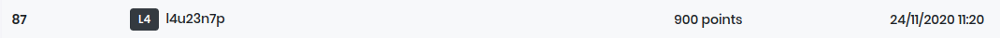

# dghack-2020

Le challenge DG’hAcK est un challenge cybersécurité organisé par la Direction Générale de l’Armement du Ministère des Armées.

## Ranking

## Challenge

| Challenge                    | Point | Flag |
| ---------------------------- | ----- | ---- |
| Internal support 1           | 100   | Oui  |
| Internal support 2           | 100   | Oui  |
| UpCredit                     | 100   | Oui  |
| Server room                  | 100   | Oui  |
| Walter’s Blog                | 100   | Oui  |
| Involucrypt1                 | 100   | Oui  |
| GitBad                       | 150   | Oui  |
| ShadowMallet                 | 150   | Non  |
| Dharma.exe                   | 150   | Non  |
| Sad Crypto                   | 150   | Non  |
| Bwing                        | 150   | Oui  |
| StickItUp                    | 150   | Non  |
| Time for something different | 150   | Non  |
| Strange thing                | 200   | Non  |
| FlightControl                | 200   | Non  |
| JobBoard                     | 200   | Non  |
| Involucrypt2                 | 200   | Non  |
| file_reader                  | 250   | Non  |
| MyBDD                        | 300   | Non  |
