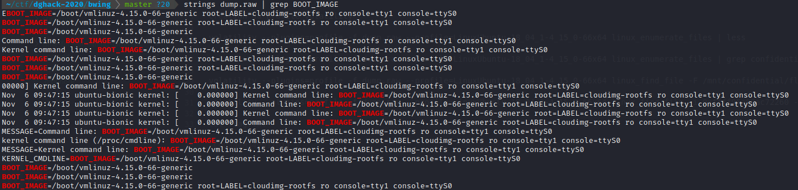
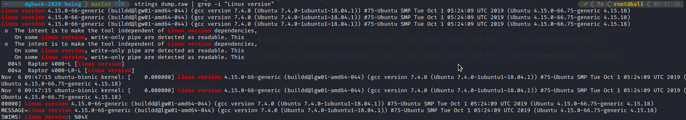
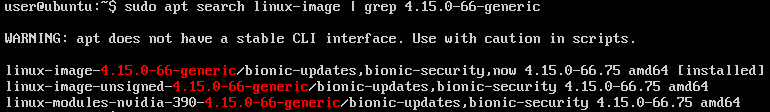

# Bwing

## Description

Un expert forensic de DGA MI doit travailler sur un dump mémoire. Au profit de l’activité missile, il doit retrouver des informations au sujet du plan d’une fusée.

## Solution

Nous savons par l'énoncé que le fichier `dump.raw` est un dump mémoire.

Il faut donc commencer par trouver l'OS utilisé pour faire le dump.

On utilise le plugin `imageinfo` de `volatility`.
Pas de chance, aucun profile ne correspond, le dump est surement issue d'une distribution linux.

On doit donc créer notre propre profil.

### Création du profil

Le première étape est d'identifier la version de linux.

```
strings dump.raw | grep BOOT_IMAGE
```



```
strings dump.raw | grep -i 'Linux version'
```



La machine a reproduire est donc un `Ubuntu 18.04` avec le kernel `4.15.0-66-generic`.

Après avoir créer une VM `Ubuntu 18.04`, on peut regarder si le kernel dont nous avons besoin est présent dans le dépot officiel.

```
sudo apt search linux-image | grep 4.15.0-66-generic
```



On a de la chance le kernel est disponible, on peut donc directement l'installer.

Avant d'installer le kernel cible, on installe les dépendances de `volatility` pour créer le profil.

```
sudo apt install zip git build-essential dwarfdump
```

On installe ensuite le kernel avec ses headers.

```
sudo apt install linux-image-4.15.0-66-generic linux-headers-4.15.0-66-generic
```

Après installation, on effectue un `reboot`. *(sur le bon kernel)*

On peut vérifier que nous avons la bonne configuration avec la commande `uname -a`.

On utilise ensuite le script [volprofile.sh](https://gist.github.com/andreafortuna/98af14f1fa5de2a9e1ce93afbfe24200/) pour genérer le profil.

### Analyse du dump

On récupère le profil genérer pour l'utiliser sur le fichier `dump.raw`.

Après une rapide inspection du dump avec les modules `linux_pstree` et `linux_netscan`, rien de bien important nous saute aux yeux.

Il nous reste à chercher dans les fichiers contenus dans le dump avec le module `linux_enumerate_files`. *Tips: utiliser une commande pour limiter la sortie (`less`, `head`)*

```
volatility --plugins=profile -f dump.raw --profile=LinuxUbuntu-18_04_1-4_15_0-66x64 linux_enumerate_files | less
```

On trouve ainsi le fichier `/mnt/confidential/flag.txt`.

On va donc extraire ce fichier avec le module `linux_find_file`.

```
volatility --plugins=profile -f dump.raw --profile=LinuxUbuntu-18_04_1-4_15_0-66x64 linux_find_file -F /mnt/confidential/flag.txt

volatility --plugins=profile -f dump.raw --profile=LinuxUbuntu-18_04_1-4_15_0-66x64 linux_find_file -i 0xffff95a89ac72260 -O flag.txt
```

Il ne reste plus qu'a lire son contenu pour avoir le flag `C0D3N4M34P011011`.

## Write-up

- [Nicolas Bourras](https://nicolasb.fr/blog/writeup-dghack-bwing/)
